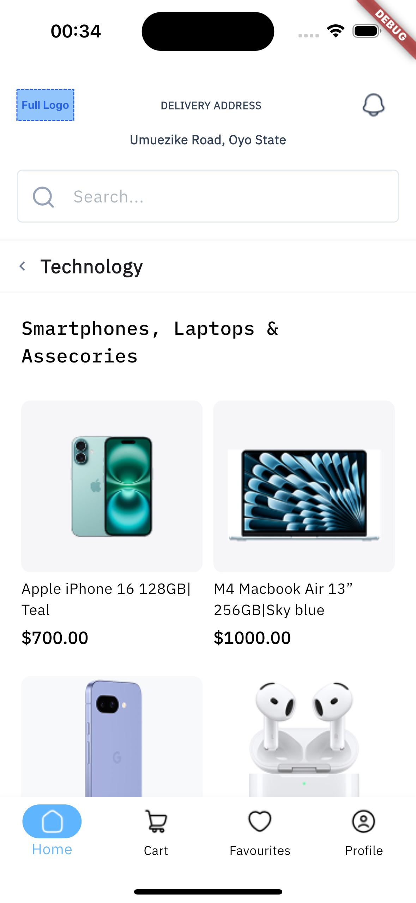
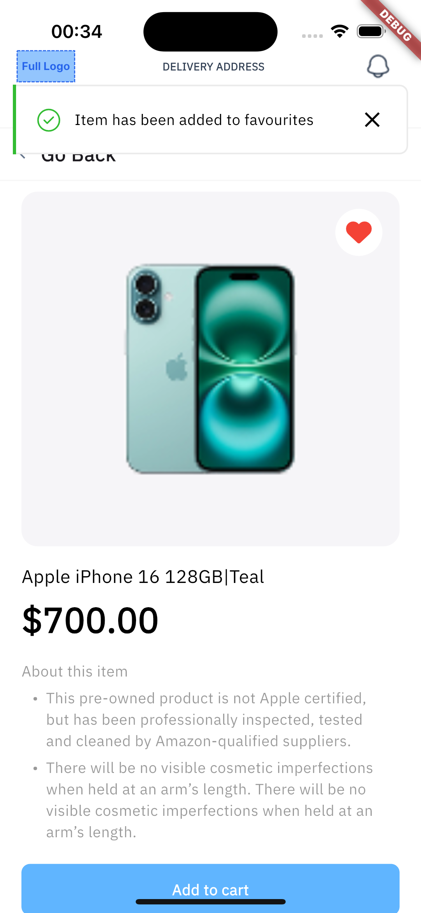
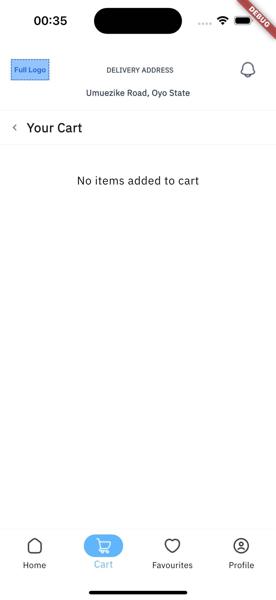

# Alpha Twelve App

A Flutter-based e-commerce mobile application that allows users to browse shop items, view item details, add items to a cart, and manage cart quantities with toast notifications. This app was developed as a demonstration of Flutter development skills for an interview review.

## 📱 Features

- **Shop Item Details**: View item images, prices, and descriptions with "Add to cart" button
- **Cart Management**: Add, increase/decrease quantity, and delete items using Riverpod
- **Toast Notifications**: Show notifications when items are added to the cart
- **Formatted Prices**: Display prices with comma separators (e.g., $1,000)
- **Responsive UI**: Uses SingleChildScrollView and GridView.builder for smooth scrolling

## 🛠 Tech Stack

| Component               | Technology           | Version       |
| ----------------------- | -------------------- | ------------- |
| **Framework**           | Flutter (Dart)       | 3.x           |
| **State Management**    | Riverpod             | ^2.5.1        |
| **UI Design**           | Material Design      | Built-in      |
| **Toast Notifications** | toastification       | ^3.0.3        |
| **Image Loading**       | transparent_image    | ^2.0.1        |
| **Icons**               | font_awesome_flutter | ^10.7.0       |
| **Number Formatting**   | intl                 | ^0.19.0       |
| **Build Tools**         | Gradle               | 8.12          |
| **Android NDK**         | NDK                  | 27.0.12077973 |
| **Backend**             | In-memory            | None          |

## 🚀 Getting Started

### Prerequisites

Before you begin, ensure you have the following installed:

- [Flutter SDK](https://flutter.dev/docs/get-started/install) (version 3.x or higher)
- [Android Studio](https://developer.android.com/studio) with Android SDK
- Android NDK (27.0.12077973)
- Git
- VS Code or Android Studio with Flutter/Dart plugins

### Installation

1. **Clone the repository**

   ```bash
   git clone https://github.com/ejim11/alpha_twelve_app.git
   cd alpha_twelve_app
   ```

2. **Install dependencies**

   ```bash
   flutter pub get
   ```

3. **Configure Android NDK**

   Update `android/local.properties`:

   ```properties
   ndk.dir=/opt/homebrew/share/android-commandlinetools/ndk/27.0.12077973
   ```

   Verify `android/app/build.gradle.kts`:

   ```kotlin
   android {
       ndkVersion = "27.0.12077973"
   }
   ```

4. **Set up emulator**

   ```bash
   # Create and start emulator
   emulator -avd Pixel_9_Pro_XL_API_35
   ```

5. **Verify installation**
   ```bash
   flutter doctor
   ```

### Running the App

#### Development Mode

```bash
flutter run
```

#### Build Release APK

```bash
flutter clean
flutter pub get
flutter build apk --release
```

The APK will be generated at: `build/app/outputs/flutter-apk/app-release.apk`

#### Install APK

```bash
adb install build/app/outputs/flutter-apk/app-release.apk
```

## 📦 Dependencies

```yaml
dependencies:
  flutter:
    sdk: flutter
  flutter_riverpod: ^2.5.1
  fluttertoast: ^8.2.8
  font_awesome_flutter: ^10.7.0
  transparent_image: ^2.0.1
  intl: ^0.19.0

flutter:
  assets:
    - assets/images/sample.png
```

## 🧪 Testing

The app has been tested on:

- **Android Emulators**: Pixel 9 Pro XL (API 35)
- **iOS Simulator**: iPhone 15 Pro

## 📸 Screenshots

| Home Screen                                  | Item Details                                 | Item Details (favourite item chosen)         |
| -------------------------------------------- | -------------------------------------------- | -------------------------------------------- |
|  |  |  |

| Cart Management                              | Empty cart                                   |
| -------------------------------------------- | -------------------------------------------- |
|  |  |

## 🔧 Troubleshooting

### Common Issues

1. **NDK Version Mismatch**

   ```bash
   # Ensure NDK version 27.0.12077973 is installed
   # Update android/local.properties with correct path
   ```

2. **Dependencies Issues**

   ```bash
   flutter clean
   flutter pub get
   ```

3. **Emulator Not Starting**

   ```bash
   # List available AVDs
   emulator -list-avds

   # Start specific AVD
   emulator -avd [AVD_NAME]
   ```

## 🤝 Contributing

This project was created for interview demonstration purposes. For any questions or feedback, please contact the developer.

## 📄 License

This project is created for educational and interview purposes.

## 📧 Contact

**Developer**: [Your Name]  
**GitHub**: [ejim11](https://github.com/ejim11)  
**Project Link**: [https://github.com/ejim11/alpha_twelve_app](https://github.com/ejim11/alpha_twelve_app)

---

_Built with ❤️ using Flutter_
